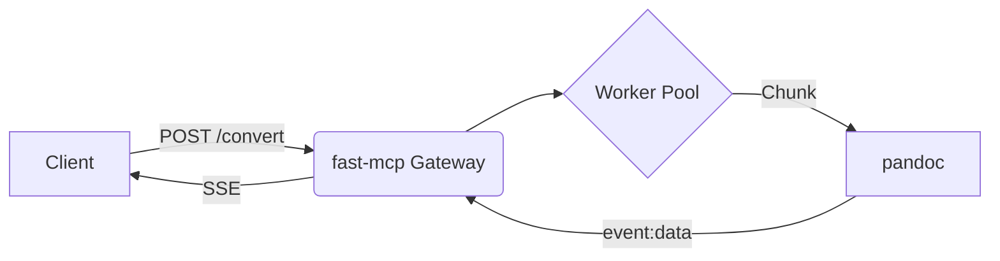

# Migration Plan: mcp-pandoc ➜ SSE (fast-mcp)

## 1 Objective

Migrate the existing **mcp‑pandoc** server by **sdtio** from a traditional request/response model to **Server‑Sent Events (SSE)** streaming, re‑implementing the service using the **fast‑mcp** framework with **full MCP protocol support**. This ensures compatibility with MCP clients like the n8n MCP Client Node.

## 2 Background

`mcp‑pandoc` currently provides document conversion but streams no incremental output, causing latency. SSE will enable realtime streaming of conversion chunks to clients, improving UX and enabling progressive rendering.

## 3 Deliverables

* A production‑ready `fast‑mcp` service exposing `/convert` SSE endpoint and `/sse` MCP protocol endpoint
* Full MCP protocol support with tool discovery and MCP-compliant event formats
* Modular plugin for pandoc conversion
* Updated client libraries (CLI, JS) supporting SSE and MCP
* Comprehensive test suite (unit, integration, load)
* Production-grade CI/CD (Docker, GitHub Actions)
* Metrics & dashboards (Prometheus/Grafana)
* Updated documentation with MCP client integration guides (including n8n)

## 4 Scope

### 4.1 In Scope

* Re‑implementation of core conversion endpoint using fast‑mcp
* Introducing SSE channel and event schema
* Refactoring pandoc handling into async worker
* Building basic HTML client demo

### 4.2 Out of Scope

* Feature‑parity for rarely‑used exotic formats
* Mobile client updates
* Large‑scale multi‑tenant auth (follow‑up project)

## 5 Architecture Overview

## 6 Milestones & Timeline (indicative)

| Week (2025) | Milestone                                 | Notes |
| ----------- | ----------------------------------------- | ----- |
| W27         | Kick‑off, repo setup, dependency audit    |       |
| W28         | Prototype SSE endpoint with static data   |       |
| W29         | Integrate pandoc worker, basic streaming  |       |
| W30         | Client SDK update, E2E PoC                |       |
| W31         | Load test, metrics, harden error handling |       |
| W32         | Staging deploy, QA                        |       |
| W33         | Production rollout & post‑mortem          |       |

## 7 Risks & Mitigation

| Risk                   | Probability | Impact | Mitigation                           |
| ---------------------- | ----------- | ------ | ------------------------------------ |
| SSE connection drops   | Medium      | High   | Reconnect logic, heartbeats          |
| Pandoc CPU spikes      | High        | Medium | Worker pool & queue, resource limits |
| fast‑mcp unfamiliarity | Medium      | Medium | Spike & pair‑programming             |

## 8 Metrics / Success Criteria

* 95th percentile TTFB ≤ 300 ms
* Streaming throughput ≥ 1 MB/s per connection
* Error rate < 0.1 %

## 9 Open Questions

* Auth mechanism for streaming endpoints?
* Back‑pressure strategy on high concurrency?
* Do we need binary (EventStream vs WebSockets fallback)?
